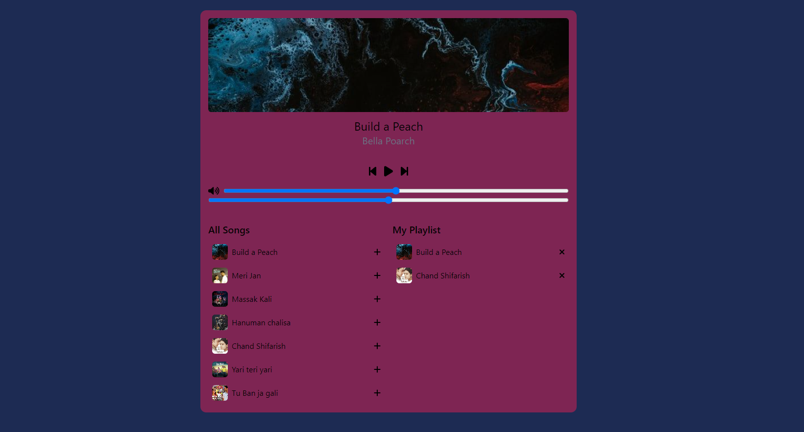

<h1>Music Player App</h1>

<p>Music Player App
This project is a web-based music player application built using React, Tailwind CSS, and Vite. It allows users to play, pause, and skip tracks, as well as add songs to a playlist and play songs from either the playlist or all available songs.
</P>

View this site here [Blitzzplayer](https://blitzzplayer.netlify.app/).

<h2>Features</h2>

Play/pause functionality

Skip track functionality

Add songs to playlist

Play songs from playlist or all songs


Responsive design using Tailwind CSS

<h2>Technologies Used</h2>

React - JavaScript library for building user interfaces

Tailwind CSS - Utility-first CSS framework

Vite - Build tool for modern web development


<h2>Geting started</h2>

```
git clone https://github.com/yourusername/music-player.git
```
```
cd music-player
```
```
npm install
```
```
npm run dev
```

## Preview 

